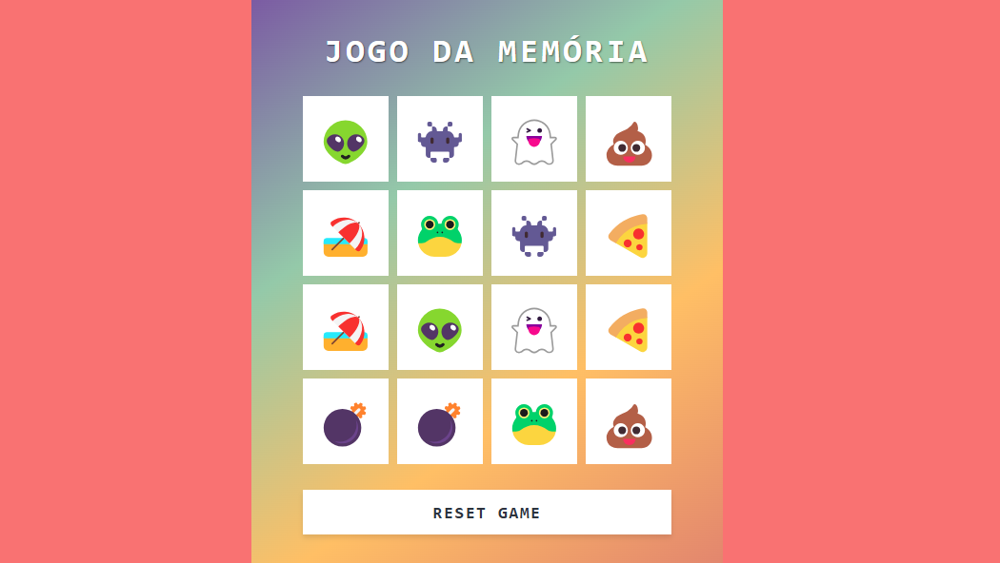

# ⭐ JavaScript: Jogo da Memória

## 🎯 Objetivo

Criar um jogo da memória como parte do Bootcamp [DIO](https://web.dio.me/home)/[RiHappy](https://www.rihappy.com.br/).

## Autor

- [@rodrigofontes92](https://www.github.com/rodrigofontes92)

### Linguagens de Marcação e Estilo:
 

## Linguagem de Programação Utilizada:

## Ferramentas Utilizadas:

### Paleta de cores via [Pantone](https://pantone.com.br/paletas-de-cores-cor-do-ano-2024-peach-plethora/)
